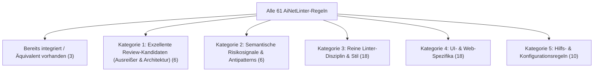

# Regelkatalog AiNetLinter und Überlegungen für AiNetReview

Dieses Dokument bietet eine vollständige Bestandsaufnahme aller 61 Linter-Regeln des Schwesterprojekts `AiNetLinter` (Stand: März 2026). Es dient als Referenz und Entscheidungsgrundlage für KI-Agenten und Entwickler, um zu beurteilen, welche dieser Regeln oder dahinterliegenden Konzepte als Review-Signale in `AiNetReview` integriert werden sollten.

---

## 1. Vollständige Regelliste (Name und Kurzbeschreibung)

Die folgende Tabelle listet alle in `AiNetLinter` implementierten Regel-Identifikatoren (`LinterRuleIds` / `RuleRegistry`).

| Name | Kurze Beschreibung |
| :--- | :--- |
| `AIContextFootprint` | Transitive Codezeilenzahl einer Klasse inklusive aller im Quellcode referenzierten eigenen Projekttypen; misst die Kontext- und Token-Kosten für KI-Agenten ("Lost in the Middle"). |
| `AllowCancellationShutdownCatch` | Erlaubt als Ausnahme das lautlose Abfangen von `OperationCanceledException` / `TaskCanceledException` bei geordnetem Host-Shutdown. |
| `AllowDynamic` | Verbietet das Typschlüsselwort `dynamic`, um vollständige statische Typinferenz und fehlerfreie Refactorings durch Agenten zu gewährleisten. |
| `AllowedEmptyReads` | Verbietet Daten-Leseoperationen ohne unmittelbaren Guard (Null-/Gültigkeitsprüfung) direkt nach dem Aufruf. |
| `AllowOutParameters` | Verbietet `out`-Parameter in Methodensignaturen zugunsten von aussagekräftigen Records oder Tuples mit benannten Elementen. |
| `AllowTryPatternOutParameters` | Erlaubt `out`-Parameter als Ausnahme in idiomatischen `Try*`-Methoden, `Is*`-Mustern und `Deconstruct`-Signaturen. |
| `AllowUnsealedPartialClasses` | Erlaubt als Ausnahme unversiegelte `partial`-Klassen (z. B. für generierten Code, Blazor-Komponenten oder WPF Code-Behind). |
| `AvoidExcessiveMiddleMen` | Erkennt Klassen, die überwiegend als reine Weiterleitungsschicht agieren (Forwarding-Verhältnis > Schwellenwert ohne eigene Transformationslogik), was Tool-Call-Overhead und Indirektion erzeugt. |
| `BanAsyncVoid` | Verbietet `async void`-Methoden und lokale Funktionen (Ausnahme: UI-Event-Handler), da unbehandelte Ausnahmen den Prozess unkontrolliert beenden. |
| `BanBlockingTaskAccess` | Verbietet blockierende Aufrufe auf asynchronen Tasks (`.Wait()`, `.Result`, `.GetAwaiter().GetResult()`) zur Vermeidung von ThreadPool-Erschöpfung und Deadlocks. |
| `BanPublicNestedTypes` | Verbietet `public` und `internal` geschachtelte Typen, damit alle API-Elemente als eigenständige Dateien existieren und in Datei-Listings/Grep auffindbar sind. |
| `BlazorRequireCodeBehind` | Erzwingt die Auslagerung von C#-Logik aus `.razor`-Markup-Dateien in separate `.razor.cs`-Code-Behind-Dateien (`partial class`). |
| `BlazorRequireCssIsolation` | Verlangt zu jeder `.razor`-Komponente mit Styling eine isolierte `.razor.css`-Begleitdatei anstelle von Inline-`<style>`-Tags. |
| `CSS_MaxCssLineCount` | Begrenzt die Zeilenanzahl pro CSS-Datei, um unübersichtliche Riesen-Stylesheets zu verhindern. |
| `CSS_MaxCssSelectorComplexity` | Begrenzt die Verschachtelungstiefe von CSS-Selektoren, um übermäßige Spezifität und Styling-Konflikte zu vermeiden. |
| `CSS_ParseError` | Meldet syntaktische Parse-Fehler in CSS-Dateien, die eine weitere statische Analyse verhindern. |
| `CSS_PreferScopedCss` | Mahnt globale CSS-Dateien mit vielen Regeln ab und empfiehlt Scoped CSS (`.razor.css`), um Seiteneffekte (Butterfly-Effekt) zu minimieren. |
| `DetectAndBanPhantomDependencies` | Verbietet unauflösbare `using`-Direktiven (Halluzinationen) sowie dynamisches Nachladen von Typen per Reflection (`Assembly.LoadFrom`, `Activator.CreateInstance`). |
| `DuplicateCode` | Solution-weite Token-CPD-Erkennung (Jaccard-N-Gram) für fast identische oder stark ähnliche Methodenblöcke (DRY-Verstoß / Code-Klone). |
| `EnforceAsciiIdentifiers` | Verbietet Nicht-ASCII-Zeichen (Umlaute, Emojis, Akzente) in allen Bezeichnern; schützt vor Tokenizer-Drift und Homoglyphen-Angriffen (Trojan Source). |
| `EnforceExplicitStateImmutability` | Zwingt Klassen (außer DTOs/Entities) zu unveränderlichem Zustand (`readonly` Felder, `init`-only Properties). |
| `EnforceMinimalApiAsParameters` | Verlangt in ASP.NET Core Minimal APIs bei mehr als vier Parametern die Bündelung über das `[AsParameters]`-Attribut. |
| `EnforceNamespaceDirectoryMapping` | Stellt sicher, dass deklarierte Namespaces exakt der physischen Verzeichnisstruktur im Projekt entsprechen. |
| `EnforceNoSilentCatch` | Verbietet leere oder stumme `catch`-Blöcke, die Ausnahmen ohne Logging, Rethrow oder Zuweisung verschlucken. |
| `EnforceNullableEnable` | Erzwingt die Direktive `#nullable enable` am Beginn jeder C#-Quelldatei für lückenlose Null-Safety. |
| `EnforcePascalCase` | Validiert die Einhaltung von PascalCase für alle öffentlichen Klassen, Structs, Records, Interfaces, Methoden und Properties. |
| `EnforceResultPatternOverExceptions` | Verbietet `throw` für fachlichen Kontrollfluss; verlangt die explizite Modellierung von Fehlerzuständen über Result-Typen (`Result<T>`). |
| `EnforceSealedClasses` | Erzwingt den Modifikator `sealed` (oder `sealed partial`) auf allen konkreten Klassen, um unbedachte Vererbungshierarchien zu verhindern. |
| `EnforceSemanticNaming` | Verbietet generische Bezeichner (`data`, `temp`, `obj`) in öffentlichen Signaturen sowie werkzeuggenerierte Dummy-Namen (`MyRegex`, `NewMethod`, `Class1`). |
| `EnforceValueObjectContracts` | Verlangt für Typen mit Namenssuffix `ValueObject`, dass sie als `record` oder `readonly struct` mit unveränderlichen Eigenschaften implementiert sind. |
| `EnforceXmlDocumentation` | Erzwingt XML-Dokumentationskommentare (`/// 
`) an öffentlichen Typen und Schnittstellen. |
| `ForbiddenNamespaceDependency` | Prüft deklarierte Architekturregeln auf unerlaubte Namespace-Abhängigkeiten (z. B. Domain darf nicht auf Infrastructure zugreifen). |
| `JS_EnforceJsModules` | Verlangt, dass JavaScript-Dateien als ES6-Module mit `export` aufgebaut sind, und verbietet Zuweisungen an das globale `window`-Objekt. |
| `JS_MaxJsLineCount` | Begrenzt die Zeilenanzahl von JavaScript-Dateien; komplexe Logik soll in C# verbleiben, JS dient nur als dünne Interop-Schicht. |
| `JS_SyntaxError` | Meldet syntaktische Parse-Fehler in JavaScript-Dateien. |
| `MaxAIContextFootprint` | Identisch mit `AIContextFootprint`: Obergrenze für transitive Codezeilen aller direkten und indirekten eigenen Typ-Abhängigkeiten einer Klasse. |
| `MaxBoolParameterCount` | Begrenzt die Anzahl von `bool`-Parametern in Methoden, um unleserliche Aufrufe (`DoWork(true, false)`) ohne Kontext zu verhindern. |
| `MaxCognitiveComplexity` | Obergrenze für die kognitive Komplexität nach SonarSource (Verschachtelung, logische Operatoren, Abbruchbedingungen). |
| `MaxConstructorDependencies` | Maximale Anzahl an Konstruktor- und Primärkonstruktor-Parametern; Indikator für zu viele Verantwortlichkeiten (SRP). |
| `MaxCyclomaticComplexity` | Obergrenze für die zyklomatische Komplexität nach McCabe (Anzahl linear unabhängiger Pfade durch eine Methode). |
| `MaxDirectoryChildren` | Maximale Anzahl an Dateien und Unterordnern in einem einzelnen Verzeichnis; verhindert überfüllte Ordner. |
| `MaxDirectoryDepth` | Maximale Ordnertiefe ab der `.csproj`-Ebene; verhindert unübersichtlich tiefe Verzeichnisbäume. |
| `MaxInheritanceDepth` | Maximale Vererbungstiefe eigener Klassen (unter Ausschluss von Framework-Typen wie `System.Object` oder UI-Basisklassen). |
| `MaxLineCount` | Maximale Zeilenanzahl pro C#-Datei; beugt Monolithen vor, die das lesbare Kontextfenster sprengen. |
| `MaxLinqChainLength` | Begrenzt die Anzahl hintereinander geschalteter LINQ-Methodenaufrufe in einem einzelnen Ausdruck. |
| `MaxMethodLineCount` | Maximale Zeilenanzahl pro Methode (ohne Leerzeilen und Kommentare); fördert kleine, fokussierte Methoden. |
| `MaxMethodOverloads` | Maximale Anzahl gleichnamiger Methodenüberladungen pro Klasse; verhindert Signatur-Verwechslungen durch Modelle. |
| `MaxMethodParameterCount` | Maximale Anzahl an Parametern in einer Methodensignatur; empfiehlt ab Überschreitung Parameter-Records. |
| `MaxPartialClassFiles` | Begrenzt die Anzahl physischer Teildateien, auf die eine einzelne logische `partial class` verteilt werden darf. |
| `MaxPublicMembersPerType` | Maximale Anzahl an öffentlichen Methoden, Properties und Events pro Typ; begrenzt die Angriffs- und Verwechslungsfläche. |
| `MaxSwitchArms` | Maximale Anzahl an Zweigen in einem `switch`-Ausdruck oder -Statement; empfiehlt Dispatch-Tabellen oder Auslagerung. |
| `PreventContextDependentOverloads` | Verbietet Überladungen mit gleicher Parameteranzahl, die sich ausschließlich durch primitive Typen unterscheiden (z. B. `(int)` vs. `(long)`). |
| `RAZOR_BanInlineEventLambdas` | Verbietet mehrzeilige C#-Inline-Lambdas in Razor-Event-Attributen (z. B. `@onclick="() => { ... }"`). |
| `RAZOR_BanInlineTernaryInAttributes` | Verbietet Ternary-Bedingungen (`@(cond ? "a" : "b")`) direkt in HTML-Attributen; empfiehlt vorberechnete Properties im Code-Behind. |
| `RAZOR_MaxComponentParameterCount` | Begrenzt die Anzahl an Parametern bei Blazor-Komponentenaufrufen im Markup. |
| `RAZOR_MaxControlFlowBlocks` | Begrenzt die Anzahl konditionaler Steuerblöcke (`@if`, `@foreach`, `@switch`) in einer Razor-Komponente. |
| `RAZOR_MaxForeachNestingDepth` | Begrenzt die Verschachtelungstiefe von `@foreach`-Schleifen innerhalb des Razor-Markups. |
| `RAZOR_MaxMarkupNestingDepth` | Maximale Verschachtelungstiefe von HTML-Tags und Blazor-Komponenten im Markup; verhindert Tag-Mismatch-Fehler. |
| `RAZOR_MaxRazorCodeBlockLines` | Begrenzt die Zeilenanzahl verbleibender Inline-`@code`-Blöcke in `.razor`-Dateien (Guard-Regel für Code-Behind). |
| `RAZOR_MaxRazorLineCount` | Maximale Zeilenanzahl einer einzelnen `.razor`-Datei. |
| `StaticTestSentinel` | Prüft, ob für Klassen mit hoher kognitiver Komplexität entsprechende Testklassen, `typeof`-Referenzen oder `@covers`-Marker existieren. |
| `WpfRequireMinimalCodeBehind` | Verlangt, dass WPF-Code-Behind-Dateien (`.xaml.cs`) ausschließlich `InitializeComponent()` enthalten und keine Geschäftslogik beherbergen. |

*(Hinweis: `AIContextFootprint` und `MaxAIContextFootprint` bezeichnen denselben Prüfmechanismus – Ersteres ist der Rule-Identifier im Reporter, Letzteres der Schlüssel in der Konfiguration).*

---

## 2. Gruppierung nach Dimensionen

Um die Regeln für eine spätere Integration in `AiNetReview` bewerten zu können, lassen sich die 61 Regeln nach zwei unterschiedlichen, komplementären Schemata strukturieren:
1. **Technisch-fachliche Domäne** (Was wird analysiert?)
2. **Review-Tauglichkeit für AiNetReview** (Wie passt es zur Produktphilosophie von AiNetReview?)

---

### Schema A: Gruppierung nach technisch-fachlicher Domäne

#### Gruppe 1: Metriken & Dimensionierung (16 Regeln)
Diese Regeln messen numerische Größen von Methoden, Typen und Dateien gegen konfigurierte Obergrenzen:
* **Umfang & Größe**: `MaxLineCount`, `MaxMethodLineCount`, `MaxMethodParameterCount`, `MaxPublicMembersPerType`
* **Logik & Verschachtelung**: `MaxCyclomaticComplexity`, `MaxCognitiveComplexity`, `MaxSwitchArms`, `MaxLinqChainLength`
* **Struktur & Hierarchie**: `MaxInheritanceDepth`, `MaxMethodOverloads`, `MaxConstructorDependencies`, `MaxPartialClassFiles`, `MaxBoolParameterCount`
* **Projektbaum**: `MaxDirectoryDepth`, `MaxDirectoryChildren`
* **Transitive Kontextlast**: `AIContextFootprint` (bzw. `MaxAIContextFootprint`)

#### Gruppe 2: Kontrollfluss & Fehler-Resilienz (5 Regeln)
Muster, die zu Laufzeitabstürzen, stillschweigendem Datenverlust oder unkontrollierbaren Kontrollflüssen führen:
* `EnforceNoSilentCatch`: Exceptions werden unbemerkt verschluckt.
* `AllowCancellationShutdownCatch`: Geregeltes Ignorieren beim Prozess-Stopp.
* `BanAsyncVoid`: Exceptions reißen den Prozess unrettbar mit sich.
* `BanBlockingTaskAccess`: Sync-over-Async erzeugt Deadlocks und blockiert Threads.
* `EnforceResultPatternOverExceptions`: Trennung von erwarteten Domänenfehlern und Infrastruktur-Ausnahmen.

#### Gruppe 3: C#-Sprachdisziplin & Typverträge (11 Regeln)
Regeln für saubere Typmodellierung, moderne Sprachfeatures und Vermeidung fehleranfälliger Konstrukte:
* `EnforceSealedClasses` & `AllowUnsealedPartialClasses`: Verhinderung unerwünschter Vererbung.
* `BanPublicNestedTypes`: Typen müssen eigenständig im Dateisystem auffindbar sein.
* `AllowDynamic`: Verbot dynamischer Bindung.
* `AllowOutParameters` & `AllowTryPatternOutParameters`: Moderne Rückgaben statt Seiteneffekten.
* `EnforceExplicitStateImmutability`: Unveränderlichkeit von Zuständen.
* `EnforceValueObjectContracts`: Valide Records für DDD Value Objects.
* `PreventContextDependentOverloads`: Keine primitiven Verwechslungen bei Überladungen.
* `AllowedEmptyReads`: Schutz vor unvalidierten Lesezugriffen.
* `EnforceNullableEnable`: Null-Safety auf Dateiebene.

#### Gruppe 4: Namensgebung & Dokumentation (4 Regeln)
Konventionen für Verständlichkeit und Vermeidung von Halluzinationen:
* `EnforcePascalCase`: Standardisierte Schreibweise öffentlicher APIs.
* `EnforceAsciiIdentifiers`: Vermeidung von Umlauten, Emojis und Homoglyphen.
* `EnforceSemanticNaming`: Verbot nichts-sagender Platzhalter wie `temp`, `data`, `NewMethod`.
* `EnforceXmlDocumentation`: Dokumentationspflicht für öffentliche Typen.

#### Gruppe 5: Architektur, Kopplung & Modulgrenzen (5 Regeln)
Beziehungen zwischen Klassen, Namespaces und Verzeichnissen:
* `AvoidExcessiveMiddleMen`: Vermeidung unnötiger Wrapper- und Weiterleitungsklassen.
* `EnforceNamespaceDirectoryMapping`: Konsistenz zwischen physischem Pfad und Namespace.
* `DetectAndBanPhantomDependencies`: Verbot unauflösbarer Namespaces und Reflection-Laden.
* `ForbiddenNamespaceDependency`: Überwachung architektonischer Schnittstellen (z. B. Clean Architecture Slices).
* `EnforceMinimalApiAsParameters`: Strukturierte Parameterbindung in ASP.NET Core Endpunkten.

#### Gruppe 6: Testabsicherung & Code-Klone (2 Regeln)
Verifikation von Qualität und DRY-Prinzip:
* `StaticTestSentinel`: Statische Korrelation zwischen komplexen Typen und Testexistenz.
* `DuplicateCode`: Token-basierte Klon-Erkennung für ähnliche Methodenrümpfe.

#### Gruppe 7: UI-Separation & Web-Assets (18 Regeln)
Spezifische Prüfungen für Blazor, WPF, Razor, CSS und JavaScript:
* **UI-Trennung**: `BlazorRequireCodeBehind`, `BlazorRequireCssIsolation`, `WpfRequireMinimalCodeBehind`
* **CSS**: `CSS_MaxCssLineCount`, `CSS_PreferScopedCss`, `CSS_MaxCssSelectorComplexity`, `CSS_ParseError`
* **JavaScript**: `JS_MaxJsLineCount`, `JS_EnforceJsModules`, `JS_SyntaxError`
* **Razor-Markup**: `RAZOR_MaxRazorLineCount`, `RAZOR_MaxRazorCodeBlockLines`, `RAZOR_MaxMarkupNestingDepth`, `RAZOR_BanInlineEventLambdas`, `RAZOR_MaxControlFlowBlocks`, `RAZOR_MaxForeachNestingDepth`, `RAZOR_MaxComponentParameterCount`, `RAZOR_BanInlineTernaryInAttributes`

---

### Schema B: Gruppierung nach Eignung für AiNetReview

`AiNetReview` verfolgt eine andere Philosophie als `AiNetLinter`:
* **AiNetLinter**: Ein deterministisches Qualitäts-Gate / statischer Compiler-Linter mit festen Schwellwerten, Exit-Codes (`0` oder `1`) und Auto-Fixes.
* **AiNetReview**: Ein Review-Begleiter für KI-Agenten und Menschen, der **bedeutsame Signale, statistische Ausreißer und Kandidaten** sichtbar macht, ohne starre Grenzen zu erzwingen, die zu mechanischem "Code-Zerteilen" verleiten (siehe [03-product-boundaries.mdc](file:///c:/Daten/Entwicklung/Ralf/AiNetReview/.agents/rules/03-product-boundaries.mdc)).

Unter diesem Gesichtspunkt teilen sich die Regeln wie folgt auf:

#### 1. Bereits in AiNetReview integriert bzw. direktes Äquivalent vorhanden
| AiNetLinter-Regel | AiNetReview-Analyse | Bemerkung |
| :--- | :--- | :--- |
| `MaxCyclomaticComplexity` / `MaxCognitiveComplexity` | `method-control-flow-outliers` | AiNetReview nutzt keine starre Zahl (z. B. 12), sondern ein konfigurierbares Perzentil (z. B. 90. Perzentil), um die tatsächlichen Ausreißer des Projekts zu finden. |
| `DuplicateCode` | `duplicate-code-candidates` | Bereits integriert (Token-CPD mit konfigurierbarer Ähnlichkeitsschwelle). |
| *Dead-Code-Advisory* (MCP-Scan) | `dead-code-candidates` | In AiNetReview als vollwertige Produktionsanalyse implementiert. |

---

#### 2. Kategorie 1: Exzellente Kandidaten für neue AiNetReview-Signale
Diese Regeln liefern wertvolle Hinweise auf architektonische Drift, übermäßige Komplexität oder hohe kognitive Last, eignen sich hervorragend für Perzentil-/Ausreißer-Analysen und passen perfekt zu [erste-fachliche-review-signale.md](file:///c:/Daten/Entwicklung/Ralf/AiNetReview/tasks/ideen/erste-fachliche-review-signale.md):

* **`AIContextFootprint` (Transitive Verständniskosten)**:
  * *Warum relevant*: Zeigt Klassen, die so stark mit dem Rest des Projekts verwoben sind, dass ein Agent für eine Änderung tausende Zeilen Kontext lesen müsste.
  * *Review-Form*: Als Ranking der Klassen mit den höchsten transitiven Kopplungskosten (Ausreißer-Analyse statt harter Grenze).
* **`AvoidExcessiveMiddleMen` (Indirektion & Wrapper-Inflation)**:
  * *Warum relevant*: Agenten neigen dazu, zusätzliche Schichten einzufügen, die nur Aufrufe durchreichen.
  * *Review-Form*: Kandidatenliste von Klassen mit ungesundem Weiterleitungsverhältnis.
* **`MaxConstructorDependencies` / Hohe Kopplung**:
  * *Warum relevant*: Eine hohe Anzahl an Abhängigkeiten signalisiert unklare Verantwortlichkeiten (SRP-Verletzung).
  * *Review-Form*: Auffälligkeiten bei Klassen-Kopplung im Projektkontext.
* **`MaxPublicMembersPerType` (Breite API-Flächen)**:
  * *Warum relevant*: Große Oberflächen verleiten Agenten dazu, existierende Methoden zu übersehen oder versehentlich zu duplizieren.
  * *Review-Form*: Identifikation von "Gott-Klassen" und breiten APIs.
* **`ForbiddenNamespaceDependency` (Architekturrisse)**:
  * *Warum relevant*: Zeigt unerwünschte Kopplungen zwischen Modulen/Slices, bevor Zyklen entstehen.
  * *Review-Form*: Strukturierte Warnung bei Überschreitung definierter Modulgrenzen.
* **`EnforceNamespaceDirectoryMapping` (Projektstruktur-Drift)**:
  * *Warum relevant*: Verhindert, dass Dateien an falschen Orten abgelegt werden und Agenten sie nicht wiederfinden.

---

#### 3. Kategorie 2: Konkrete semantische Risikosignale
Diese Regeln betreffen keine stilistischen Feinheiten, sondern echte technische Fallstricke und Bugs, die bei autonomem agentischen Coden häufig entstehen:

* **`EnforceNoSilentCatch`**: Leere catch-Blöcke führen zu schwer auffindbaren Folgefehlern im agentischen Workflow.
* **`BanAsyncVoid`**: Kritisches Stabilitätsrisiko in C#.
* **`BanBlockingTaskAccess`**: Kritisches Performance- und Deadlock-Risiko (`.Result`/`.Wait()`).
* **`DetectAndBanPhantomDependencies`**: Schützt vor typischen Halluzinationen (nicht existierende Namespaces, dynamisches Reflection-Laden).
* **`EnforceSemanticNaming`**: Dummy-Namen (`Class1`, `NewMethod`, `MyRegex`) sind ein direkter Nachweis unvollständiger agentischer Aufgabenbearbeitung.
* **`StaticTestSentinel`**: Auffälligkeit, wenn stark verzweigter Code völlig ohne Testbezug bleibt.

---

#### 4. Kategorie 3: Reine Linter-Disziplin & Formatierung (Geringe Review-Priorität)
Diese Regeln sind für einen vorgeschalteten schnellen Linter oder Compiler-Analyzer sinnvoll, sollten aber **nicht** Teil von `AiNetReview` werden, da sie zu viel Rauschen erzeugen und keine tiefe fachliche Review-Aussage treffen:
* `EnforcePascalCase`, `EnforceAsciiIdentifiers`
* `EnforceNullableEnable` (besser im `.csproj` via `<Nullable>enable</Nullable>`)
* `EnforceSealedClasses` (strikte Architektur-Entscheidung, kein allgemeines Review-Signal)
* `EnforceXmlDocumentation` (erzeugt enorm viele triviale Meldungen)
* `AllowDynamic`, `AllowOutParameters`
* Starre Grenzwerte wie `MaxLineCount`, `MaxDirectoryDepth`, `MaxDirectoryChildren` (feste Grenzwerte führen zu falschem mechanischem Aufteilen).

---

#### 5. Kategorie 4: UI- & Web-Assets (Spezialdomäne)
* Die 18 Regeln zu Razor, CSS, JavaScript und WPF/Blazor UI-Separation sind sehr spezifisch für Frontend-Projekte.
* Eine Aufnahme in `AiNetReview` wäre erst dann sinnvoll, wenn AiNetReview explizit über C#-Quellcode hinaus auf Web-Assets erweitert werden soll.

---

## 3. Empfohlene nächste Schritte für AiNetReview

1. **Top-Kandidat für die nächste Review-Analyse**:
   * **`AIContextFootprint`** oder eine kombinierte Metrik für **transitive Verständniskosten** (siehe Priorität 2 in `tasks/ideen/erste-fachliche-review-signale.md`).
2. **Signal-Kandidat für Code-Hygiene**:
   * **`silent-catch-candidates`** oder **`async-task-blocking-candidates`** als kompakte, hochpräzise Prüfungen auf echte Fehlerquellen ohne Schwellwert-Diskussionen.
3. **Architektur-Kandidat**:
   * **`middle-man-candidates`**: Ermittlung von Klassen, die überwiegend aus reiner Delegation bestehen.
